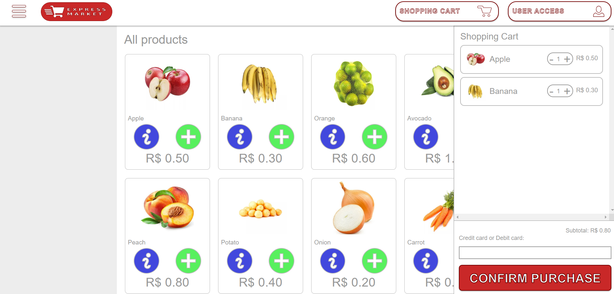
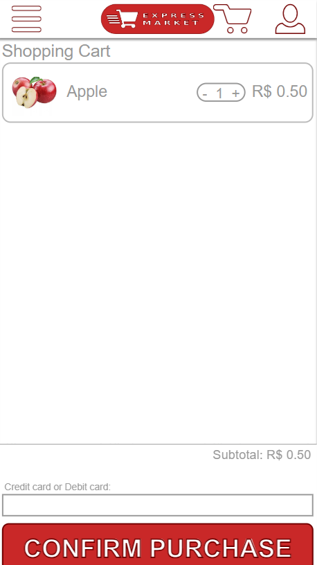
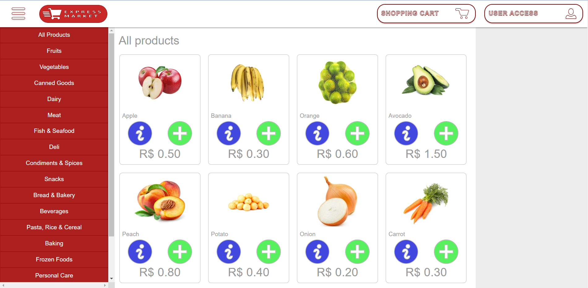
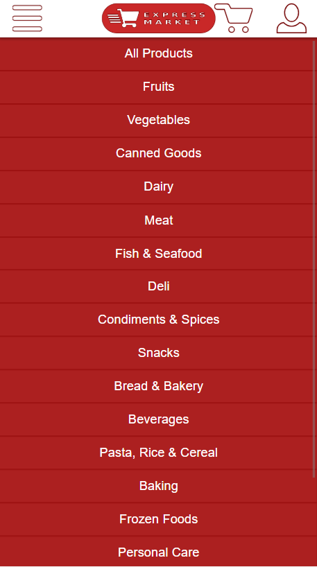
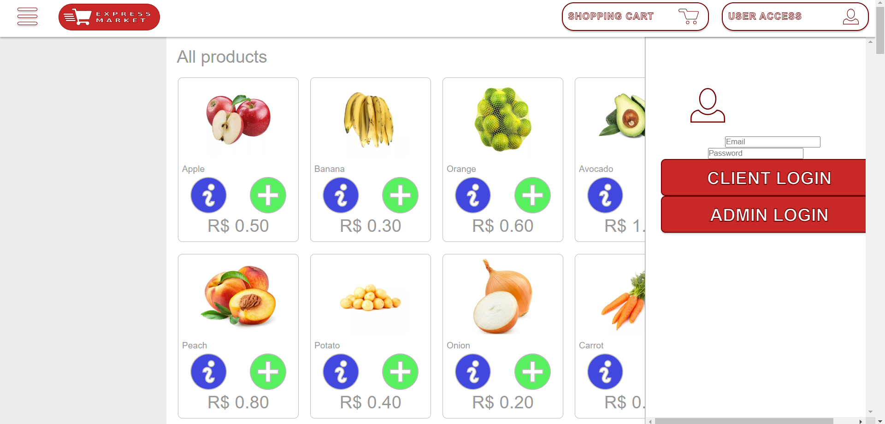
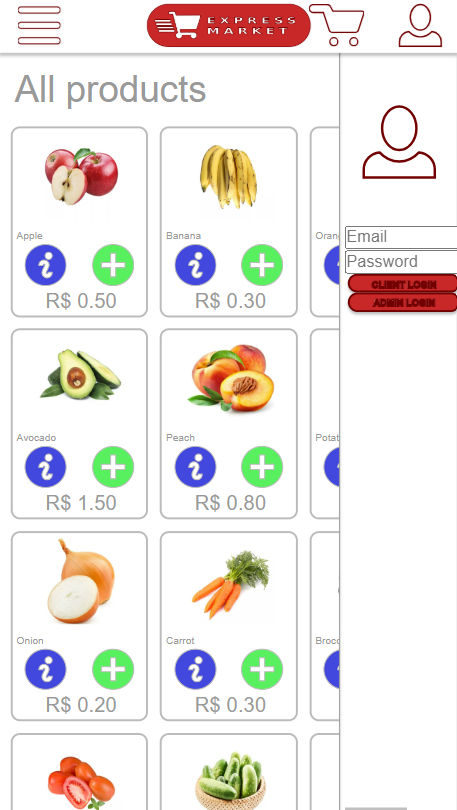

# Projeto de Desenvolvimento Web
## Alunos

Igor Boson **NUSP:** 11200571 

Rafael Takano  **NUSP:** 11200459

Olavo Morais **NUSP:** 11297792

## Requisitos
O sistema possui os mesmos requisitos explicitados na descrição do projeto. Sobre o requisito específico ao nosso sistema, temos uma loja online de um supemercado, em que cada item possui uma categoria como _fruits_ e _vegetables_, atributo que é usado para filtrar os diferentes items disponíveis no sistema.

Também, no sistema permitimos que um usuário não logado possa colocar itens no seu carrinho, e para finalizar a compra, é necessário que ele faça login. Nesse caso, é necessário que o carrinho de compras seja salvo para que o cliente não precise colocar novamente os itens no carrinho após fazer o login.

No quesito dos dados que devem ser armazenados pelo sistema, é necessário manter um acesso aos clientes e admins cadastrados e os seus atributos (id, telefone, email, e o endereço no caso dos clientes). Também um estoque dos itens, contendo id, foto, descrição, preço, quantidade em estoque, quantidade vendida e categoria. E também, um carrinho que contém os itens adicionados pelo cliente até então.

## Descrição do Projeto
O site Express Market tem dois tipos de usuário, cliente e admin. Todos os usuários podem visualizar os items disponíveis, filtrar por categorias e ver a descrição de itens. Caso seja um usuário não logado, ele pode fazer login. Tanto o usuário não logado e o cliente podem colocar itens no seu carrinho, mas para finalizar a compra o usuário deve fazer login. O usuário admin tem o poder de criar cadastrar no sistema outro usuário admin ou usuários cliente. E também, pode criar, editar ou remover itens do sistema. Ambos o cliente e admin possuem a opção de deslogar ou deletar a sua conta.

Alem disso, as informações armazenadas no servidor para essas funcionalidades acima são:

- Admin:
    - id
    - Nome
    - Email
    - Senha
    - Telefone
    - Endereço
- Cliente:
    - id
    - Nome
    - Email
    - Senha
    - Telefone
    - Endereço
- Produtos:
    - id
    - Nome
    - Foto do produto
    - Preço 
    - Descrição do Produto
    - Quantidade em estoque
    - Quantidade vendida
    - Categoria

No diagrama de navegação abaixo vemos a SPA englobada pelo possiveís estados do usuario, (Not Looged, Client, Admin), componentes que pode aparecer na tela, ações como setas implicando quem afetam e o que é possivel ser feito.

Abaixo estão os mockups das páginas:

Pagina Principal (Not Logged e Client, mobile, Admin): 

Carrinho de compras: 

 

Categorias:

 
 

Login: 

 
 

Descrição do Item:

 
 

Edição do Item (Admin): 

 

Adição de Item (Admin): 

 

Opções de Usuário (Admin): 

 

Criando Usuário (Admin):

 
 

## Comentários sobre o código
A página inicial está dividida em 3 partes principais, uma navbar, um footer e entre eles tem uma section onde estão organizados os itens. Cada item é uma div em que é organizada a imagem e informações referentes ao item. 
Na página de adição de um item, temos sobre a tela uma div com caixas de input para receber as informações do item. E na tela do carrinho, temos uma div representando o carrinho e, contido nesse elemento, temos outras divs para cada item no carrinho.

## Plano de Testes
Visto a simplicidade das páginas elaboradas até então, ainda não vimos a necessidade de fazer testes automatizados. Os testes até então foram feitos de forma manual, mexendo na proporção da tela, com diferente números de itens e tamanho dos inputs.

Mais para a frente pretendemos também utilizar o postman para testar o backend.

## Resultado dos Testes
Os resultados foram como o esperado, mas vale ressaltar que a responsividade das telas ainda não está como o esperado, e pretendemos aperfeiçoar isso nas próximas etapas.

## Como executar
### Milestone 1 (Mockups):
Para rodar o programa, é necessário baixar o código disponível aqui no github, unzipar se necessário, e abrir as páginas localizadas em [/html pages](https://github.com/Rafael-Takano/projeto-desenvolvimento-web/tree/main/html%20pages)

### Milestone 2 (Vite ou Servidor estático)
Para rodar o programa pelo vite, é necessário ter o nodeJs instalado, para isso baixe-o pelo [site](https://nodejs.org/) ou utilize seu instalador de pacotes preferido

Em seguida instale os módulos necessários para a execução do programa com o npm(Node package Manager), deve ter sido instalado junto com o NodeJs, da seguinte forma: 

`npm i` 

Para o desenvolvimento basta iniciar a aplicação com o vite: 

`npm run dev` 

Dessa forma o site será hospedado no host local e mostrará atualizações na página em tempo real.

Para ver o site hospedado em um servidor estático local é necessário entrar na pasta build/ e realizar o comando:

`python3 -m http.server 8000`

Assim o site estará hospedado no localhost:8000

## Problemas

### Milestone 1 
Tivemos dificuldades em como organizar o display dos itens, principalmente no quesito responsividade, pois o display "quebrava" quando reduzíamos o tamanho da tela, mas depois de um tempo procurando soluções conseguimos resolver.

### Milestone 2
Ainda não implementamos uma boa responsividade ná área do usuário, mas já é possível fazer login como admin e como cliente. Além disso, os jsons que fazem o papel de banco de dados não estão sendo alterados pelo admin.

## Comentários Extras 

### Milestone 1 
Não nos atentamos muito a deixar o site "dinâmico" até então, por exemplo, fazer a sidebar do carrinho aparecer somente quando o botão do carrinho é apertado, visto que a ideia dessa etapa é fazer apenas as páginas mockup.

### Milestone 2
Implementamos a maior parte das funcionalidades desejadas porém devemos agora focar em resolver os pequenos problemas citados anteriormente e focar no desenvolvimento do Back-End para finalizar o projeto.
